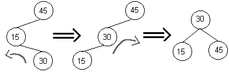
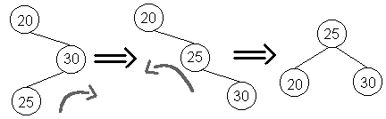

# AED2
Algoritmos e Estrutura de Dados 2

## Aula 10

Nesta aula é apresentada a Árvore Rubro Negra.

## Árvore Rubro-Negra

A árvore Rubro-Negra é uma árvore que, assim como a AVL, tem como intenção preservar seu balanceamento. Enquanto a Árvore AVL mantém um desepenho de aproximadamente 1.44Log2(N+1), a Árvore RB mantém um desempenho de aproximadamete 2Log2(N+1). Isto deve-se ao fato de que a árvore tolera um debalanceamento de até 2 níveis, enquanto a AVL tolera apenas 1 nível.

### Regras da Árvore Rubro-Negra

0. Todo nó é Negro ou Rubro.
1. A raiz é sempre Negra.
2. Um nó nulo é considerado como Negro.
3. As alturas negras de todos os nós até a raiz devem ser iguais.
4. Dois nós vermelhos não podem ser pai-filho.

* Dicas:
  1. É recomendável que um novo nó seja inserido como Rubro para evitar ferir a regra 3.
  2. Se o novo nó é a raiz, mude sua cor para preto para não ferir a regra 1.

### Remoção

Casos:

1. Nó removido é folha:
  1. Se ele for rubro, não é necessário fazer mais nada.
  2. Se ele for negro, então muda-se a cor de seu **ex-**irmão de rubro e seu **ex-**pai de negro.
2. Se o nó removido tem 1 filho:
  1. Ele será Negro e seu filho será Rubro, assim, muda-se a cor de seu **ex-**filho para Negro.
3. Se o nó tem 2 filhos:
  1. troca o valor a ser removido com o sucessor ou predecessor e então realiza-se a remoção para 1 ou para dois.

Observação: O tratamento das remoções na árvore rubro-negra, aqui descritas, estão simplificadas.
Sugiro a leitura dos slides de auxílio para aprofundar em seus aspectos.

### Visualizador para auxílio

[Visualizador](../visualizador/gt.jar)

* Necessário ter o Java Runtime.
* Para executa-lo, digite: java -cp gt.jar algvis.ui.AlgVisStandalone

### Slides de auxílio

[Slides](Arvore-RB-2.pdf)

## Operações de rotação - Revisão
As rotações podem ser realizadas para a direita ou esquerda, conforme o desbalanceamento encontrado.

Todavia, há casos em que essas rotações ao inves de corrigir o nó, acaba apenas por espelha-lo.

Assim, é necessário realizar rotações duplas, que consistem de rotacionar o filho da direção oposta para a direção oposta para então realizar a rotação do nó para a direção desejada.

Todavia, para saber se é necessário realizar uma rotação simples ou dupla, basta verificar o sinal do fator de balanceamento do nó desbalanceado e de seu filho na  direção oposta à direção a ser rotacionada. Se os fatores tiverem sinais diferentes é necessário uma rotação dupla, caso o contrário é necessário uma rotação simples.
