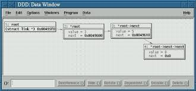

# AED2
Algoritmos e Estrutura de Dados 2

## Aula 5

Nesta aula é apresentado como funciona ponteiros em listas e árvores com auxilio do Data Display Debuger (DDD) para Linux.

Também foi apresentado como modularizar estruturas de dados a partir de arquivos de cabeçalhos (.h) e bibliotecas (.c).

Alguns de códigos usando a abordagem de modularização estão disponíveis nos arquivos de exemplo abaixo:
[Exemplo Pilha](exemplo1/)
[Exemplo Arvore](exemplo2/)

