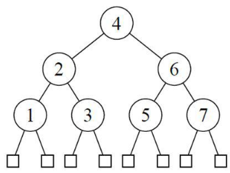
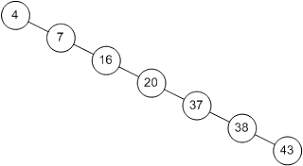
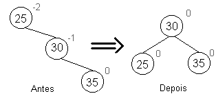
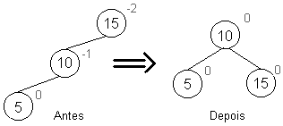
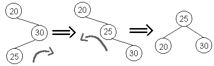

# AED2
Algoritmos e Estrutura de Dados 2

## Aula 8

Nesta aula é apresentado problema da degeneração/desbalanceamento de árvore e a árvore AVL.

### Desbalanceamento / Degeneração

Suponha que as chaves de 1 a 7 sejam inseridas na seguinte ordem:
4, 2, 6, 1, 3, 5, 7.

A árvore resultante é uma árvore que possui a quantidade possível de nós em cada nível, e todos os nós folha estão em um único nível. Desta forma nossa árvore está completamente balanceada.

Todavia, suponha que as chaves abaixo sejam inseridas na seguinte ordem:

4, 7, 16, 20, 37, 38, 43.

Observe que, embora as chaves sejam inseridas na ordem crescente, o resultado da árvore será o equivalente a uma lista simplesmente encadeada. Desta forma, perdemos a grande vantagem de uma ávore balanceada. Esta árvore sofreu uma degeneração ou desbalanceamento.

Destaco que tanto a inserção quanto a remoção provocam desbalanceamentos. Assim, faz-se necessário reorganizar a árvore a cada operação. Para isto é necessário conhecer o fator de balanceamento, calculando-se das folhas para a raiz. Um nó está balanceado desde que o módulo da diferença entre as alturas das sub-arvores esquerda e direita deste seja menor que dois. Caso o contrário, é necessário realizar operações de rotação.

## Operações de rotação
As rotações podem ser realizadas para a direita ou esquerda, conforme o desbalanceamento encontrado.

Todavia, há casos em que essas rotações ao inves de corrigir o nó, acaba apenas por espelha-lo.

Assim, é necessário realizar rotações duplas, que consistem de rotacionar o filho da direção oposta para a direção oposta para então realizar a rotação do nó para a direção desejada.

Todavia, para saber se é necessário realizar uma rotação simples ou dupla, basta verificar o sinal do fator de balanceamento do nó desbalanceado e de seu filho na  direção oposta à direção a ser rotacionada. Se os fatores tiverem sinais diferentes é necessário uma rotação dupla, caso o contrário é necessário uma rotação simples.

Um exemplo incompleto está disponível em:
[exemplo 7](exemplo7/)

## Atividades

1. Implementar a AVL com a *Estratégia 1*.

2. Implementar a AVL com a *Estratégia 2*.

3. Implementar a AVL com a *Estratégia 3*.

4. Implementar a AVL com a *Estratégia 4*.

_Submissão via SIGA-A. Link será aberto em breve._
