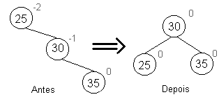
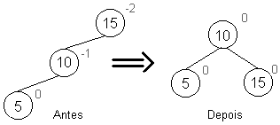
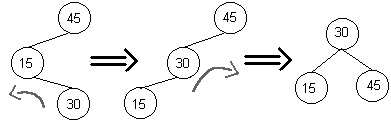

# AED2
Algoritmos e Estrutura de Dados 2

## Aula 9

Nesta aula é apresentada a Árvore Rubro Negra.

## Árvore Rubro-Negra

A árvore Rubro-Negra é uma árvore que, assim como a AVL, tem como intenção preservar seu balanceamento. Enquanto a Árvore AVL mantém um desepenho de aproximadamente 1.44Log2(N+1), a Árvore RB mantém um desempenho de aproximadamete 2Log2(N+1). Isto deve-se ao fato de que a árvore tolera um debalanceamento de até 2 níveis, enquanto a AVL tolera apenas 1 nível.

### Regras da Árvore Rubro-Negra

0. Todo nó é Negro ou Rubro.
1. A raiz é sempre Negra.
2. Um nó nulo é considerado como Negro.
3. As alturas negras de todos os nós até a raiz devem ser iguais.
4. Dois nós vermelhos não podem ser pai-filho.

* Dicas:
  1. É recomendável que um novo nó seja inserido como Rubro para evitar ferir a regra 3.
  2. Se o novo nó é a raiz, mude sua cor para preto para não ferir a regra 1.

### Inserção

Na inserção da árvore RB usa-se o mesmo princípio das árvores convencionais, porém, verifica-se se alguma regra da mesma foi quebrada. De fato, só é verificado se a regra 4 foi quebrada e assim, realiza-se mudanças de cor ou rotações para se ajusta-la.

Casos:

1. O nó é raiz, então muda sua cor para negro.
2. Seu pai é negro, insere-se e nao realiza mais nada.
3. Seu pai é rubro:
  1. Seu tio é rubro, então muda-se a cor do pai e do tio para negro e o avô para vermelho. Todavia, se o avô for a raiz, mantem-se ele negro (ou retorna ele para negro).
  2. Seu tio é negro (nó real ou nulo):
   1. O nó inserido é externo, muda-se a cor do pai para negro e o avô para vermelho, então realiza-se uma rotação no avô para o sentido oposto ao nó inserido.
   2. O nó inserido é interno, realiza uma rotação em seu pai para o sentido oposto ao nó e transforma no caso 2.1, então realiza o caso 2.1.

### Visualizador para auxílio

[Visualizador](../visualizador/gt.jar)

* Necessário ter o Java Runtime.
* Para executa-lo, digite: java -cp gt.jar algvis.ui.AlgVisStandalone

### Slides de auxílio

[Slides](Arvore-RB-1.pdf)

## Operações de rotação - Revisão
As rotações podem ser realizadas para a direita ou esquerda, conforme o desbalanceamento encontrado.

Todavia, há casos em que essas rotações ao inves de corrigir o nó, acaba apenas por espelha-lo.

Assim, é necessário realizar rotações duplas, que consistem de rotacionar o filho da direção oposta para a direção oposta para então realizar a rotação do nó para a direção desejada.

Todavia, para saber se é necessário realizar uma rotação simples ou dupla, basta verificar o sinal do fator de balanceamento do nó desbalanceado e de seu filho na  direção oposta à direção a ser rotacionada. Se os fatores tiverem sinais diferentes é necessário uma rotação dupla, caso o contrário é necessário uma rotação simples.
